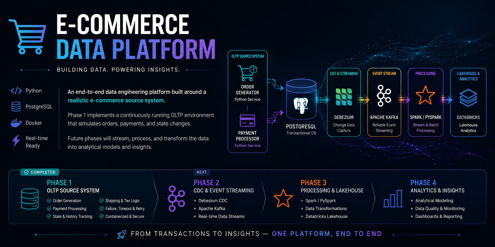
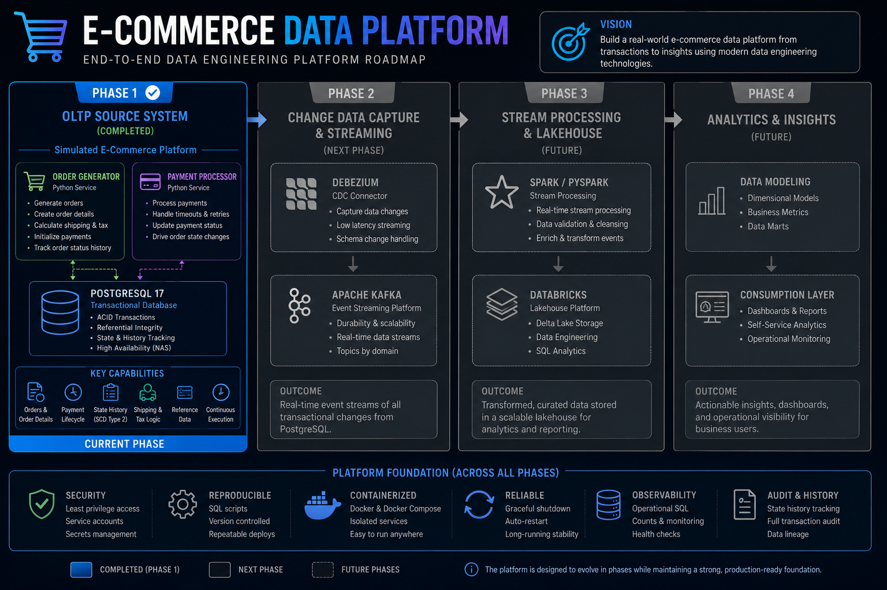
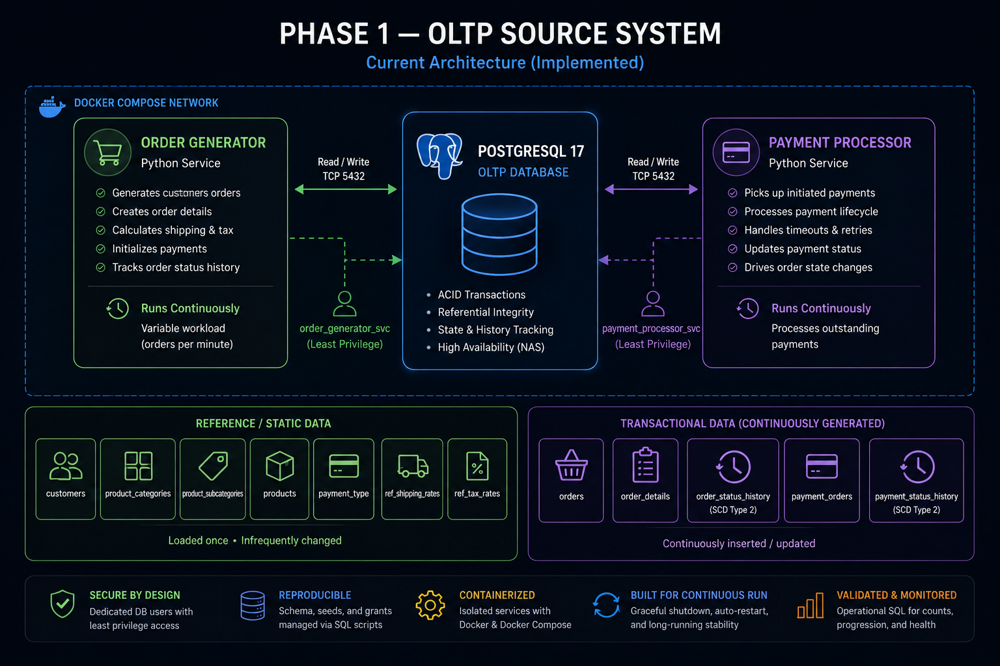
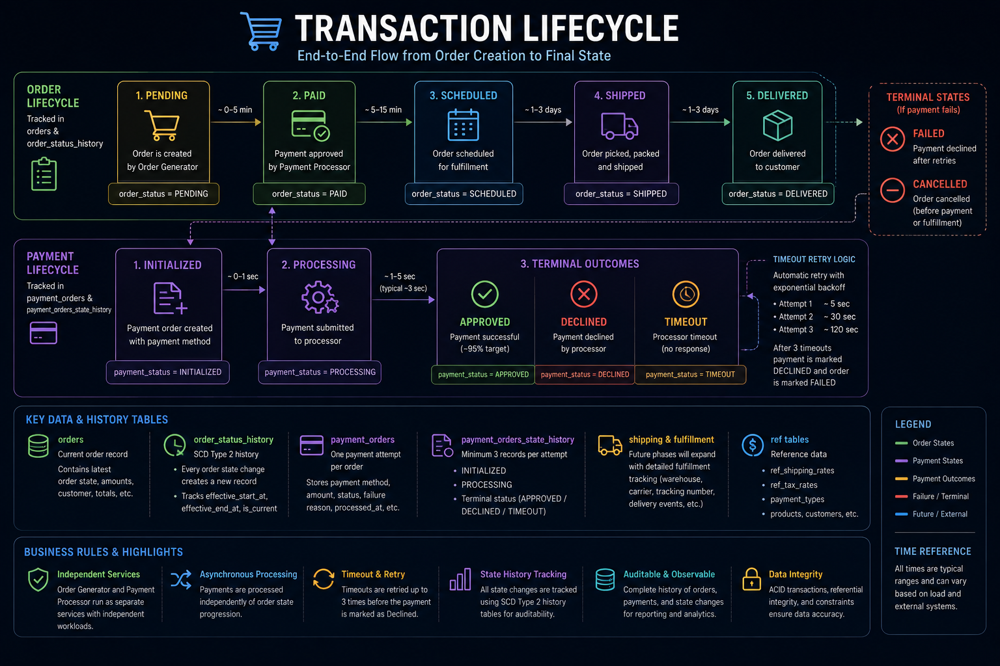

# E-Commerce Data Platform


## Project Roadmap

The OLTP source system is the foundation for a larger data engineering
platform. Future phases will introduce CDC, streaming, distributed
processing, lakehouse storage, and analytics.



## Phase 1 — OLTP Source System

A containerized, continuously running **e-commerce OLTP simulation platform** built with Python, PostgreSQL, and Docker.

This repository represents **Phase 1 of a larger end-to-end data engineering project**.

Phase 1 focuses on designing and building the operational source system itself: a realistic e-commerce backend that continuously generates orders, processes payments independently, tracks transactional state changes, and produces the type of evolving data expected from a production OLTP system.

Rather than beginning the data-engineering pipeline with a static dataset, I wanted to build the system that **creates the data first**.

### Phase 1 — OLTP Source System ✅


**Python • PostgreSQL • Docker • Docker Compose**

* Continuous order generation
* Independent payment processing
* Transaction and payment state management
* Historical state tracking
* Shipping and sales-tax calculations
* Payment failures, timeouts, and retries
* Dedicated database service accounts
* Least-privilege database permissions
* Reproducible database deployment
* Long-running containerized execution

### Phase 2 — Streaming & CDC 🚧

**Planned: Debezium • Apache Kafka**

Capture transactional changes from PostgreSQL and publish them as event streams for downstream processing.

### Phase 3 — Data Processing & Lakehouse

**Planned: Spark / PySpark • Databricks**

Transform the streaming transactional data into analytical datasets and build out the downstream data platform.


---

## Project Overview

The platform currently consists of two independent Python services backed by PostgreSQL:

### Order Generator

Continuously generates simulated e-commerce transactions including:

* Customer orders
* Order line items
* Product selection
* Shipping costs
* State-based sales tax
* Payment initialization
* Order status history
* Payment status history

### Payment Processor

Runs independently from the order generator and processes outstanding payments through their lifecycle.

Payments progress through states such as:

```text
INITIATED
    ↓
PROCESSING
    ↓
┌──────────┬──────────┬─────────┐
│ APPROVED │ DECLINED │ TIMEOUT │
└──────────┴──────────┴─────────┘
```

Payment outcomes then drive the corresponding order state.

This separation allows the system to behave more like independent backend services rather than a single script generating completed records.

# Transaction Lifecycle

Orders and payments are modeled as separate but related state machines.
The payment processor independently advances payment state, with successful
or failed payment outcomes driving corresponding changes to the order.



The system maintains historical state records rather than only preserving
the latest transaction state, allowing the complete lifecycle of an order
or payment to be reconstructed.

---

# Architecture

```text
                    ┌─────────────────────┐
                    │    Docker Compose   │
                    └──────────┬──────────┘
                               │
             ┌─────────────────┼─────────────────┐
             │                 │                 │
             ▼                 ▼                 ▼
    ┌────────────────┐ ┌────────────────┐ ┌───────────────┐
    │ Order Generator│ │Payment Processor│ │  PostgreSQL   │
    │     Python     │ │     Python     │ │      OLTP     │
    └───────┬────────┘ └───────┬────────┘ └───────▲───────┘
            │                  │                  │
            │                  │                  │
            └──────────────────┴──────────────────┘
```

Both application services operate independently and connect to PostgreSQL using dedicated service accounts.

---

# Current Technology Stack

| Technology         | Purpose                                                              |
| ------------------ | -------------------------------------------------------------------- |
| **Python**         | Transaction generation and payment-processing services               |
| **PostgreSQL 17**  | OLTP transactional database                                          |
| **psycopg**        | PostgreSQL connectivity                                              |
| **Docker**         | Service containerization                                             |
| **Docker Compose** | Multi-container orchestration                                        |
| **uv**             | Python dependency and environment management                         |
| **SQL**            | Schema design, state management, validation, and operational queries |

---

# Database Model

The current database contains **12 tables** split between static/reference data and continuously generated transactional data.

## Static / Reference Data

```text
customers
product_categories
product_subcategories
products
payment_type
ref_shipping_rates
ref_tax_rates
```

These tables provide the source data required by the transaction generator.

## Transactional Data

```text
orders
order_details
order_status_history
payment_orders
payment_status_history
```

These tables are continuously populated and updated while the services run.

---

# Order Lifecycle

Orders begin in an initial state and progress based on downstream processing.

A simplified lifecycle is:

```text
PENDING
   │
   ├── Payment Approved ──→ PAID ──→ downstream fulfillment
   │
   └── Payment Failed ────→ FAILED
```

Payment state is deliberately maintained separately from order state.

This allows payment processing behavior to evolve independently while the order represents the overall business transaction.

---

# Payment Processing

Payments are created by the order generator and processed asynchronously by the payment-processing service.

Typical progression:

```text
INITIATED
    ↓
PROCESSING
    ↓
APPROVED
```

The simulator also generates unsuccessful outcomes:

```text
PROCESSING
    ├── APPROVED
    ├── DECLINED
    └── TIMEOUT
```

Timeout behavior can result in additional processing attempts before the transaction ultimately succeeds or fails.

This creates more realistic transactional data than immediately assigning a final payment state during order creation.

---

# Historical State Tracking

Rather than storing only the latest state, the system maintains historical state records.

### Order Status History

`order_status_history` records order-state transitions over time.

This makes it possible to analyze:

* How long orders remain in a particular state
* Order progression
* Failed order behavior
* Current versus historical state
* Operational bottlenecks

### Payment Status History

`payment_status_history` records payment processing transitions.

A payment may therefore have history similar to:

```text
INITIATED
    ↓
PROCESSING
    ↓
TIMEOUT
    ↓
PROCESSING
    ↓
APPROVED
```

The history tables intentionally produce more records than their parent transactional tables.

---

# Transaction Generation

The generator creates variable workloads rather than inserting a fixed number of identical transactions.

Generated orders include variation across:

* Customers
* Products
* Product categories
* Order size
* Payment method
* Shipping class
* Shipping cost
* Sales tax
* Payment outcome

Product selection is weighted to create a more realistic mix between standard, large, and oversized items.

---

# Shipping Logic

Products are assigned shipping classes:

```text
STANDARD
LARGE
OVERSIZED
```

Shipping rates are maintained separately in:

```text
ref_shipping_rates
```

The order's shipping cost is determined using the highest applicable shipping class represented in the order.

This keeps shipping rules separate from transactional logic and allows rates to be modified independently.

---

# Sales Tax

Sales tax is calculated using state-level reference data stored in:

```text
ref_tax_rates
```

Order totals therefore include separate calculations for:

```text
Subtotal
+ Shipping
+ Sales Tax
----------------
Final Charge Amount
```

This creates additional attributes for future analytical and transformation workloads.

---

# Payment Methods

The simulator supports multiple payment types, including:

* Visa
* Mastercard
* American Express
* Discover
* PayPal
* Apple Pay
* Google Pay
* Venmo
* Shop Pay
* Amazon Pay

Payment methods are selected using weighted distributions rather than uniform random selection.

---

# Service Account Security

One of the goals of the project is to model operational practices in addition to generating data.

The continuously running services **do not connect to PostgreSQL using the database administrator account**.

Instead:

```text
Order Generator
      │
      ▼
order_generator_svc
      │
      ▼
PostgreSQL


Payment Processor
      │
      ▼
payment_processor_svc
      │
      ▼
PostgreSQL
```

Each service receives only the database permissions required for its responsibilities.

For example, the payment processor can update payment/order state without receiving unrestricted administrative access to the database.

Administrator credentials are reserved for database deployment and maintenance.

---

# Environment-Based Configuration

Database credentials and connection parameters are provided through environment variables.

Python services consume generic configuration:

```python
db_params = {
    "host": os.getenv("DB_HOST"),
    "port": os.getenv("DB_PORT"),
    "dbname": os.getenv("DB_NAME"),
    "user": os.getenv("DB_USER"),
    "password": os.getenv("DB_PASSWORD"),
}
```

Docker Compose supplies different credentials to each service at runtime.

Secrets are stored outside source control using `.env`.

---

# Reproducible Database Deployment

The PostgreSQL environment can be recreated entirely from source-controlled SQL.

```text
ddl_scripts/
├── 1_generator_schema.sql
├── 2_static_data.sql
├── 3_create_service_accounts.sql
└── 4_service_accounts_grants.sql
```

The numbered scripts provide an explicit deployment order:

```text
Create Schema
      ↓
Load Static Data
      ↓
Create Service Accounts
      ↓
Apply Least-Privilege Grants
      ↓
Start Application Services
```

The rebuild process has been tested by destroying the development schema and recreating the environment from these scripts.

---

# Project Structure

```text
generator_project_v1/
│
├── ddl_scripts/
│   ├── 1_generator_schema.sql
│   ├── 2_static_data.sql
│   ├── 3_create_service_accounts.sql
│   └── 4_service_accounts_grants.sql
│
├── sql_scripts/
│   ├── counts.sql
│   └── progression_count.sql
│
├── src/
│   ├── common/
│   │   └── utils.py
│   │
│   ├── database/
│   │   ├── database_insert.py
│   │   └── database_retrieve.py
│   │
│   ├── generator/
│   │   ├── bootstrap_generator.py
│   │   └── create_batch_orders.py
│   │
│   └── payment_processor/
│       ├── bootstrap_payment_processor.py
│       └── processor_logic.py
│
├── src_data/
├── test/
│
├── Dockerfile.generator
├── Dockerfile.payment-processor
├── docker-compose.yml
├── deployment_readme.md
├── pyproject.toml
└── uv.lock
```

---

# Operational Validation

The repository contains SQL queries for monitoring the simulator while it runs.

`counts.sql` provides general table-count validation.

`progression_count.sql` is used to inspect transaction progression and ensure orders and payments are moving through their expected states.

These queries are particularly useful during long-running stability tests.

---

# Long-Running Deployment

The application is designed to operate continuously rather than generate a dataset once and exit.

The current deployment runs as Docker containers on a home NAS:

```text
NAS
│
├── PostgreSQL
├── Order Generator
└── Payment Processor
```

Docker restart policies allow the services to recover from container or host restarts.

Long-duration testing is being used to validate:

* Transaction throughput
* Payment-processing backlog
* State consistency
* History-table growth
* Container stability
* Database resource usage

---

# Why I Built This

This project originally started because I wanted realistic source data for a streaming data-engineering project.

Static CSV datasets are useful for learning transformations, but they don't reproduce many of the characteristics of operational systems:

* Records arriving continuously
* Transactions changing state
* Failed transactions
* Retry behavior
* Historical state changes
* Relationships between transactional entities
* Independent processes operating against the same database

Instead of finding another dataset, I decided to build the source system.

That source system has since evolved into a project of its own.

---

# Future Architecture

The PostgreSQL application is intended to become the OLTP source for a larger data-engineering platform.

Planned evolution:

```text
                 E-Commerce Simulator
                         │
                         ▼
                    PostgreSQL
                         │
                         │ CDC
                         ▼
                     Debezium
                         │
                         ▼
                       Kafka
                         │
                         ▼
                  Spark / PySpark
                         │
                         ▼
                Databricks / Lakehouse
                         │
                         ▼
                Analytics / Monitoring
```

Future phases can introduce:

* Change Data Capture (CDC)
* Debezium
* Apache Kafka
* Streaming ingestion
* Spark / PySpark
* Databricks
* Bronze / Silver / Gold data modeling
* Data-quality validation
* Pipeline observability
* Analytical models
* Operational dashboards

The goal is to build the downstream data platform around a source system whose behavior I fully understand because I designed it.

---

# Current Status

**Phase 1 — E-Commerce OLTP Simulator: Operational**

Current capabilities include:

* Continuously generated transactions
* Independent order and payment services
* Realistic payment-state progression
* Payment timeout/failure behavior
* Historical state tracking
* Shipping and tax calculations
* Weighted transactional distributions
* PostgreSQL persistence
* Dockerized deployment
* Dedicated database service accounts
* Least-privilege database access
* Environment-based secrets
* Reproducible database deployment
* Operational validation queries
* Long-running NAS deployment

**Next phase:** use the simulator as the live source for a streaming data-engineering pipeline.

---

## Deployment

Detailed instructions for recreating and running the environment are available in:

```text
deployment_readme.md
```

The database schema and required static data can be completely recreated using the numbered scripts under:

```text
ddl_scripts/
```